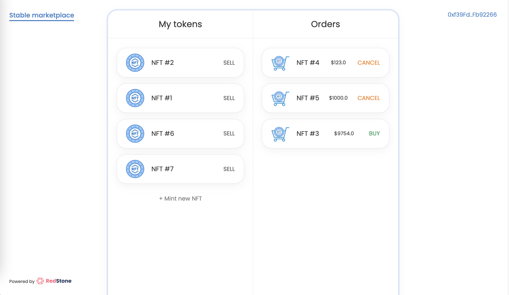
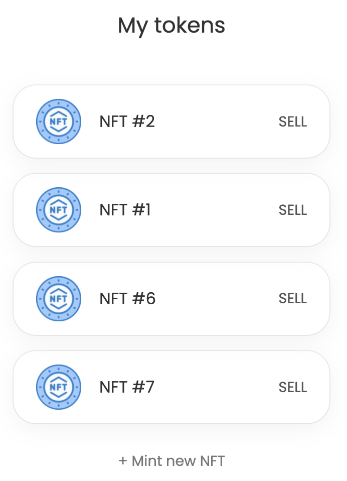
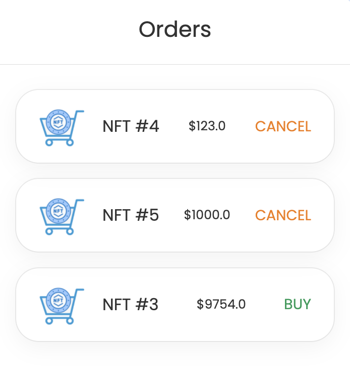
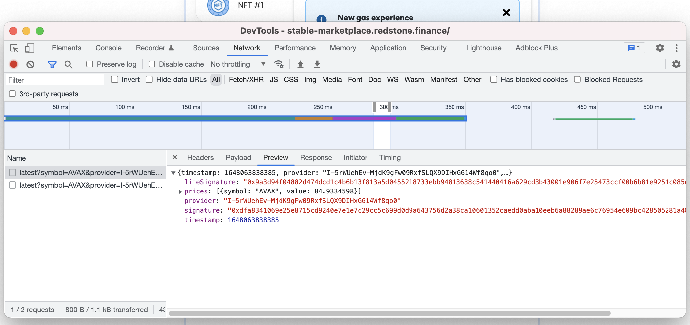

# Stable price NFT marketplace

This is an example implementation of a dApp that uses [RedStone oracles.](https://redstone.finance/)

The repo contains an implementation of an NFT marketplace dApp with so-called "stable" price. It means that sellers can create sell orders (offers), specifying price amount in USD. But buyers are able to pay with native coins, required amount of which is calculated dynamically in the moment of the order execution.

## 🙋‍♂️ Need help?
Please feel free to contact the RedStone team [on Discord](https://redstone.finance/discord) if you have any questions.

## 🧑‍💻 Implementation

We use [hardhat](https://hardhat.org/) and [ethers.js](https://docs.ethers.io/v5/) for deployment scripts and contract tests and [React](https://reactjs.org/) for frontend imlpementation.

### Code structure

```bash
.
├── contracts                   # Solidity contracts
│   ├── ExampleNFT.sol          # Example ERC721 contract
│   ├── Marketplace.sol         # Simple NFT marketplace contract
│   ├── StableMarketplace.sol   # NFT marketplace contract with stable price
│   └── ...
├── public                      # Folder with public html files and images for React app
├── scripts                     # Contract deployment scripts
├── src                         # React app source code
│   ├── App.js                  # Main React component
│   ├── blockchain.js           # JS module responsible for interaction with blockchain and contracts
│   ├── config/                 # Folder with contract ABIs and deployed contract addresses
│   └── ...
├── test                        # Contract tests
└── ...
```

### Contracts

#### ExampleNFT.sol

`ExampleNFT` is a simple ERC721 contract with automated sequential token id assignment

```js
function mint() external {
    _mint(msg.sender, nextTokenId);
    nextTokenId++;
}
```

This contract extends `ERC721Enumerable` implementation created by the `@openzeppelin` team, which adds view functions for listing all tokens and tokens owned by a user.

#### Marketplace.sol

`Marketplace` is an NFT marketplace contract, which allows to post sell orders for any NFT token that follows [EIP-721 non-fungible token standard](https://eips.ethereum.org/EIPS/eip-721). It has the following functions:

```js

// Created a new sell order
// This function requires approval for transfer on the specified NFT token
function postSellOrder(address nftContractAddress, uint256 tokenId, uint256 price) external {}

// Only order creator can call this function
function cancelOrder(uint256 orderId) external {}

// Allows to get info about all orders (including canceled, and executed ones)
function getAllOrders() public view returns (SellOrder[] memory) {}

// Returns expected price in ETH tokens for a given order
function getPrice(uint256 orderId) public view returns (uint256) {}

// Requires sending at least minimal expected ETH tokens
function buy(uint256 orderId) external payable {}

```

The implementation is quite straightforward, so we won't describe it here. You can check the full contract code in the [contracts/Marketplace.sol.](contracts/Marketplace.sol)

#### StableMarketplace.sol

`StableMarketplace` is the marketplace contract with the stable price support. It extends the `Marketplace.sol` implementation and only overrides its `_getPriceFromOrder` function.

```js
// `_getPriceFromOrder` function uses the `getPriceFromMsg` function,
// which fetches signed data from tx calldata and verifies its signature
function _getPriceFromOrder(SellOrder memory order)
    internal
    view
    override
    returns (uint256)
{
    return (order.price / getPriceFromMsg(bytes32("ETH"))) * (10**8);
}
```

For being able to use RedStone data, the contract extends the `PriceAware.sol` redstone contract.

```js
import "redstone-evm-connector/lib/contracts/message-based/PriceAware.sol";
import "./Marketplace.sol";

contract StableMarketplace is Marketplace, PriceAware {
    ...
}
```

It also overrides the `isSignerAuthorised` function from `PriceAware.sol` contract and specifies trusted data signer address.

```js
// You can check addresses for authorized redstone signers at:
// https://github.com/redstone-finance/redstone-evm-connector/blob/master/README.md#1-modifying-your-contracts
function isSignerAuthorized(address _signer)
    public
    pure
    override
    returns (bool)
{
    return _signer == 0x0C39486f770B26F5527BBBf942726537986Cd7eb;
}
```

### Frontend

You can check the code of the React app in the `src` folder. We tried to simplify it as much as possible and leave only the core marketplace functions.

The main UI logic is located in the `App.js` file, and the contract interaction logic is in the `blockchain.js` file.

If you take a look into the `blockchain.js` file code, you'll notice that each contract call that needs to process RedStone data is made on a contract instance, that was wrapped by [redstone-evm-connector](https://www.npmjs.com/package/redstone-evm-connector).

```js
import { WrapperBuilder } from "redstone-evm-connector";

async function getContractInstance(contractName) {
  ...
  return new ethers.Contract(address, abi, signer);
}

async function buy(orderId) {
  const marketplace = await getContractInstance("marketplace");

  // Wrapping marketplace contract instance.
  // It enables fetching data from redstone data pool
  // for each contract function call
  const wrappedMarketplaceContract = WrapperBuilder
    .wrapLite(marketplace)
    .usingPriceFeed("redstone", { asset: "ETH" });

  // Checking expected amount
  const expectedEthAmount = await wrappedMarketplaceContract.getPrice(orderId);

  ...
}
```

You can read much more about contract wrapping and `redstone-evm-connector` [here.](https://www.npmjs.com/package/redstone-evm-connector)

### Tests

We've used hardhat test framework to contract tests. All the tests are lcoated in the [test](test/) folder.

💡 Note that each contract function that needs RedStone oracle data is also called on a wrapped ethers contract instance.

```js
const expectedEthAmount = await wrappedMarketplaceContract.getPrice(orderId);
```

## 🔥 How to use the app

### Deployed version
The app is already deployed on the Kovan testnet. You can check it at: https://kovan-stable-marketplace.redstone.finance/

### Build the app locally
You can also clone this repo and build the app locally. Please follow the steps below:

#### 1. Clone this repo
```sh
git clone https://github.com/redstone-finance/stable-price-marketplace
cd stable-price-marketplace
```

#### 2. Install dependencies
```sh
yarn install
```

#### 3. Run local blockchain node (using hardhat)
```sh
yarn run-local-node
```

#### 4. Deploy contracts on local blockchain
```sh
yarn deploy-contracts:local
```

#### 5. Run react app
```sh
yarn app:start
```

The app should be running on http://localhost:3000

#### 6. Congifure metamask

##### 6.1 Add local hardhat network to metamask
Select `Networks dropdown` -> `Add network` and enter the following details:
**Network Name**|**hardhat-local**
:-----:|:-----:
New RPC URL|http://localhost:8545
Chain ID|31337
Currency Symbol|ETH

Then hit the `Save` button.

##### 6.2 Add local wallets to metamask
- `User 1`: `0xac0974bec39a17e36ba4a6b4d238ff944bacb478cbed5efcae784d7bf4f2ff80`
- `User 2`: `0x59c6995e998f97a5a0044966f0945389dc9e86dae88c7a8412f4603b6b78690d`

You can see more keys in your console below the `yarn run-local-node`

#### 7. Explore the app in browser



##### Mint NFTs
After visiting the app first time you will see an almost empty screen with the `+ Mint new NFT` link. Click this link to mint new NFTs. After the minting transaction confirmation you will see your NFT in the left column.



##### Post sell orders
Once you mint any NFTs, you can post sell order for each one of them. Click the SELL button and provide the USD value. You will be asked to confirm 2 transactions: for NFT transfer approval, and for the marketplace order creation. After their confirmation, you will see your order in the Orders column.



##### Buy NFTs
You can also switch metamask account and buy the NFT. I would recommend to open the developer tools in browser at the network tab and explore network requests that are being sent before the buy transaction sending.

You should see at least 2 requests with the ETH price data and crypto signatures. This data along with signatures is being attached for each contract call, that wants to process redstone oracle data.


